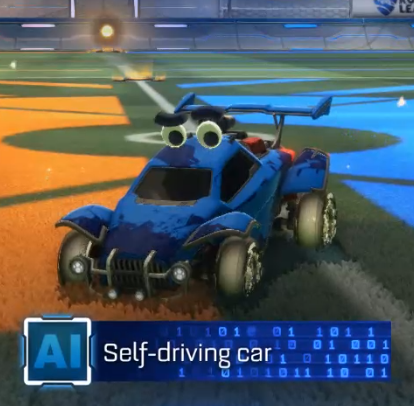

# Self-driving car

A bot that plays Rocket League using [RLBot].

## Accolades

🥇 **1st** – RLBot Wintertide 1v1 2019-03-09
[[Braacket part 1](https://braacket.com/tournament/wintertide)]
[[Braacket part 2](https://braacket.com/tournament/A37EF959-99F3-46D5-8E5F-5705B0B8E410)]
[[Video](https://www.twitch.tv/videos/392931154)]

🥇🥈 **1st** and **2nd** – RLBot Wintertide 2v2 2019-03-10
[[Video](https://www.twitch.tv/videos/393467640)]  
(1st with teammate ReliefBot)  
(2nd with teammate also_MichaelBot)

🥇 **1st** – New Year Invitational 2019-01-21
[[Braacket](https://braacket.com/tournament/512D32C1-AC86-4820-A668-D5C83EC60B79)]
[[Video](https://www.youtube.com/watch?v=n5sB-EscTkM)]

🥈 **2nd** – Snowbot Showdown 2018-12-16
[[Braacket](https://braacket.com/tournament/69BF67CC-54A5-4212-B108-1677922358C9)]
[[Highlight video](https://www.youtube.com/watch?v=E4ub6w3srjM)]

## Development

### Prerequisites

* Windows

  RLBot only works on Windows, and we inherit this limitation.

* Install [Rust](https://www.rust-lang.org/).

* Install [pre-commit], and run this command:

  ```sh
  pre-commit install
  ```

  This will run tests/lints/etc before every commit. The bot may lose every
  game, but at least the code will be pretty!

* Obtain these files from [RLBot] and copy them somewhere in your `PATH` (or
  alternatively, to avoid polluting your system, `target/debug` and
  `target/release`):

  * `RLBot_Core.dll`
  * `RLBot_Core_Interface.dll`
  * `RLBot_Injector.exe`

[pre-commit]: https://pre-commit.com/
[RLBot]: http://www.rlbot.org/

### Watch the bot play

```sh
cargo run -p play
```

### Run the bot with the RLBot framework

```sh
cargo build --release && \
    ( cd tourney/contents && python -c "from rlbot import runner; runner.main()" )
```

### Run integration tests

The integration tests require a copy of Rocket League running (naturally).

```sh
cargo test -p brain -- --test-threads=1 integration
```

To run an individual test, you can replace `integration` with a pattern that
matches the name of the test.

### Profiling

Adapt this command to your needs:

```sh
vsperf="C:\Program Files (x86)\Microsoft Visual Studio\2017\Enterprise\Team Tools\Performance Tools\VSPerf.exe"
RUST_BACKTRACE=1 \
"$vsperf" \
    -launch:target/debug/deps/brain-a1b2c3.exe \
    -args:"--test-threads=1 recording_template --ignored"
```

### Build a tournament package

```sh
tourney/build.sh
```

This will package up a release build in `target/tournament/`. It will also copy
in a `rlbot.cfg` for quick testing. You can test the build by starting Rocket
League and then running:

```sh
( cd target/tournament && python -c "from rlbot import runner; runner.main()" )
```

Once you know it works, zip up the directory and send it to the tournament
organizer!

## Handy Links

### Rocket League

* [RLBot wiki – Useful Game Values](https://github.com/RLBot/RLBot/wiki/Useful-Game-Values)
* [Vehicle specifications](https://www.reddit.com/r/RocketLeague/comments/7fotyx/vehicle_specifications_v139_hitboxes_handling/)
* [Sam Mish's RL physics notes](https://samuelpmish.github.io/notes/RocketLeague/)
  * [RLUtilities](https://github.com/samuelpmish/RLUtilities)
* [DomNomNom's bot](https://github.com/DomNomNom/RocketBot)

### Math

* [Biarc interpolation](http://www.ryanjuckett.com/programming/biarc-interpolation/)
* [Rotation converter](https://www.andre-gaschler.com/rotationconverter/)
* [Parabola trajectory math](http://hyperphysics.phy-astr.gsu.edu/hbase/traj.html)
* [Grade-school kinematics equations](http://zonalandeducation.com/mstm/physics/mechanics/kinematics/EquationsForAcceleratedMotion/EquationsForAcceleratedMotion.htm)
